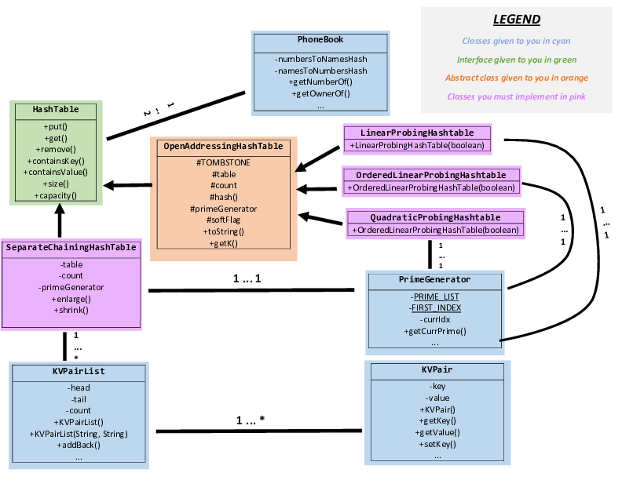
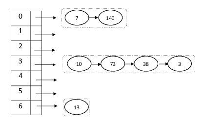
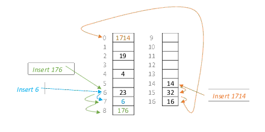

# Hash Tables

## Overview

In this project, you will have to implement an abstraction over a *phonebook*;
a collections of pairs of type `<`*Full_Name*,*Phone_Number*`>`. Your phonebook
will support **both** name-based search and phone-based search. Here is a
pictorial view of the project:


To make both types of searches efficient, your phonebook will internally
maintain **a pair of hash tables** from `String`s to `String`s: One will have
the **person's name as a key** and the **phone number as a value**, and the
other one will have the **phone number as a key** and the **name as a value**!
In your simple phonebook, **entry uniqueness** is **guaranteed**: Every person
has **exactly one** phone number, and every phone number is associated with
**exactly one** person.

## Getting Started

As before, this project is provided to you through a GitLab repository. If you
are viewing this on the web, you should clone either the master repository
or your personal repository. After you have cloned the project, you should
study the JavaDocs and source code provided to understand how your methods can
be used (and tested). The classes you have to implement are under the package
`hashes`.

## Provided Code

### Class hierarchy



The above diagram depicts the code structure for the project. Simple lines
reflect one-to-many "has-a" relations, while arrows show "is-a" relations
(derived class, implemented interface, etc.). The top-level class of the
project is `Phonebook`. What is interesting about `Phonebook` is that **it has been
implemented for you!** However, the methods of `Phonebook` depend on methods
of the interface `HashTable`, which is implemented (directly or through
`OpenAddressingHashTable`) by the four classes which you will have to implement.
What *you* will need to do is complete the implementation of these four
classes so that their methods can support the methods of `Phonebook`. The
Release Tests **primarily** test methods of `Phonebook` (approximately 90%
of their code), while a smaller number of tests check if you are implementing
basic hash table functionality correctly (e.g. resizings, see below).

The various methods of `Phonebook` will have to run in *amortized constant time*
(except for `size()` and `isEmpty()`, which should run in *constant* time).
This does *not* take into account the case of an insertion or deletion that
results in a *resizing* of the array; we want amortized constant time
*assuming* that a resizing does **not** occur in that particular operation.
We **will** be checking your source code after submission to make sure you
are **not** implementing the methods **inefficiently** (e.g. logarithmic
complexity, linear complexity, or even worse)!

In practice, the only way you can do this is by **not** consulting the hash
function **at all** for your operations; just **looping over the entire table**
until you either find the element (`remove`, `containsKey`) or you find an
empty position (`put`). While this would indeed allow you to pass the tests,
we will be **checking your submission** to make sure you **consult the
hash function!** Implementing all operations as mentioned above would
constrain them to be *linear time*, which is **unacceptable** for both the
project (*ie*, no credit for this project) and Computer Science **as a whole**.
That said, **not all** of the methods you implement make use of the hash
function, which means that their complexity parameters will necessarily by
different. (Can you find any such methods?)

You should fill in the `public` methods of `SeparateChainingHashTable`,
`LinearProbingHashTable`, `OrderedLinearProbingHashTable`, and
`QuadraticProbingHashTable`. For the last three classes, you might find that
some of the methods have the **exact same source code**. You would then
benefit by making them `protected` methods in the `OpenAddressingHashTable`
class, which those three classes extend!

### Interfaces, `abstract` classes, and the `protected` access modifier

In the code base, you might notice that `HashTable` is a Java *interface*.
On the otehr hand, `OpenAddressingHashTable` is an `abstract` class. Abstract
classes in Java are almost like interfaces, except they are allowed to contain
fields and their members do **not** default to `public`. Similarly to
interfaces, one **cannot** instantiate an `abstract` class.

The choice of making `OpenAddressingHashTable` an `abstract` class is
deliberate; several methods and fields of **all** your Openly Addressed hash
tables are common across **all** of these classes. Therefore, it makes sense
to package them into *one place* and debug them in *one place*. Unfortunately,
Java interfaces do **not** allow for storing fields, but only methods, which
are also implicitly `public`. Essentially, the `HashTable` interface tells us
what kinds of methods any `HashTable` instance **ought** to satisfy. For
example, every `HashTable` instance needs to provide a method called `put`,
with two `String` arguments, `key` and `value`, as well as a return value of
type `Probes`. Refer to the section on *Classes under `utils`* for a short
diatribe on this small class. It should also answer questions of key
containment (`containsKey(String key)`) and queries of its current stored key
count (`size()`) and capacity (`capacity()`).

On the other hand, any Openly Addressed Hash Table needs to have some common
fields and functionality. They all need an array over `KVPair` instances. They
all need to answer queries of size and capacity in $`O(1)`$. They can all
benefit from an overriding of `toString()`, which we provide for you and is
very useful for debugging[^1]. Therefore, this entire piece of common
functionality can (and should) be packages in **one common place**, and this
place in our code base is `OpenAddressingHashTable`.

You might notice that all the fields and methods of `OpenAddressingHashTable`
besides `toString()` are labeled with the `protected` access modifier.
`protected` essentially means: "visible by derived classes". In more detail,
every *identifier* (name) of a field or a method that has been declared
`protected` in a base class can be *straightforwardly* accessed from a derived
class by its name, without any prepending of base class name or of any other
name. This is very useful for your code! You might notice that
`LinearProbingHashTable`, `OrderedLinearProbingHashTable`, and
`QuadraticProbingHashTable`, all classes that you **must** implement, have
**no** `private` **fields** (but if you would like to add some, please go
right ahead). In fact, our own implementation of the project does not add any
extra fields in the classes (but we **do** use `private` methods for
readability).

This is, of course, **not** a perfect approach towards building this code
base. For example, you might notice that `SeparateChainingHashTable`, the only
collision resolution method you have to implement that is not an Open
Addressing method, *necessarily* has to declare some `private` fields that
we also see in `OpenAddressingHashTable`. Also, somebody can argue that since
`OrderedLinearProbingHashTable` has so many common characteristics (the
*Collision Resolution Methods* section analyzes this in some detail) with
`LinearProbingHashTable`, one could make the former a subclass of the latter.
You can come up with many different approaches of refactoring this code base,
but
**PLEASE DON'T, OTHERWISE YOU MIGHT END UP NOT PASSING ANY OF OUR UNIT TESTS!**
The *only* thing you can do is add your own `private` fields or
methods in the classes you have to implement and, in the case of the three
Open Addressing methods you have to implement, you can move some of the common
code you build as `protected` methods in `OpenAddressingHashTable`. See the
comments at the very end of that class's definition for a relevant prompt.

The **tl;dr** of what you *can* and *cannot* change in the code base is this:
unit tests test `public` functionality and they also need to be aware of type
information at **compile-time**, since Java is a *strongly* typed language.

 * Are you in any way breaking the `public` methods' signatures and/or return types?
 * Are you in any way altering the code base's hierarchy by making classes extend other classes and interfaces?
 
If the answer to **both** of these questions is **no**, you are good, otherwise you are **not** good.

[^1]: So, if you are *persistent* about **not** using the debugger, **at least print your table** before coming to office hours, please.

### Classes under `hashes`

Besides the classes you have to implement, you are given the following classes
under the package `hashes`:

 * `CollisionResolver`: A simple `enum` which only contains four named fields,
  disambiguating between the various collision resolution methods that you
  will have to implement.
 * `HashTable`: The top-level interface discussed in the previous two sections.
 * `OpenAddressingHashTable`: The abstract class discussed in the previous two sections.

### Classes under `utils`

The package `utils` will be *indispensable* to you. Here is a short description
of what every class in the package does. Refer to the JavaDocs for a *complete*
and *concrete* description of arguments, returns values, `Exceptions` thrown,
etc. Without consulting the JavaDocs, you are **extremely likely to not be
passing several tests.** For example, some of our tests expect that you will
`throw` particular `Exception` instances in certain cases: The JavaDoc is your
**only** guide in those situations! This list is just a **high-level**
understanding of the methods.

 * `KVPair`: An important abstraction for **Key-Value pairs**. Time and again
   in this class, we have conveyed to you that we are assuming that the
   *value* with which a particular (and unique) *key* is associated is what
   we are *really* interested in, and the keys are only useful for somehow
   organizing the potentially infinite set of values, such that we can insert,
   search, and delete as efficiently as possible, taking into consideration
   issues of cache locality, where our memory resides, how hard these K-V
   stores are to implement, etc.
   
   `KVPair` implements exactly that: it is a simple class which encapsulates
   **both** the key **and** the value into one place so that we can access
   the value from the key in $`O(1)`$. In C/C++, we would probably have
   replaced it with a `struct`.
 * `KVPairList`: An explicitly coded linked list that holds `KVPair` instances.
   It is only useful for `SeparateChainingHashTable`. If you are wondering why we opted
   for coding an entirely new list instead of simply using one of Java's
   several generic `List`s, refer to the FAQ at the end for an explanation of
   how Java treats arrays of generic types, such as `KVPairList`. The short
   answer is: **not well at all**.
 * `KVPairListTests`: A simple unit testing library for `KVPairList`.
 * `PrimeGenerator`: A *very* important **singleton** class which controls the
   re-sizing parameters for **all** of your `HashTable` instances. In lecture,
   we have discussed the importance of keeping the size of your hash table
   to a *prime* number. This class helps us with that. In particular, you
   should study the JavaDocs for `getNextPrime()` and `getPreviousPrime()`,
   since you will certainly be using those methods for your own purposes.
   Both of these methods run in *constant* time, since we have already stored
   a large list of primes as a `static` shared field of the `PrimeGenerator`
   class, and the various primes can be accessed by indexing into that field.
 * `PrimeGeneratorTests`: A simple unit testing library for `PrimeGenerator`.
 * `NoMorePrimesException`: A type of `RuntimeException` that `PrimeGenerator`
   uses when it runs out of primes to provide to an application.
 * `Probes`: Arguably
   **the most important class for your testing and understanding**.
   The most important operations of `HashTable` instances, which are `put`,
   `get`, and `remove`, **all** return `Probes` instances. These instances
   contain the *value* of a key that was inserted, sought, or deleted (`null`
   in the case of a failure of any kind), and, crucially, the
   **number of probes** that it took for the operation to succeed **or fail**.
   In this way, we can determine if you have understood how the collision
   resolution methods are supposed to work! Specifically, what the **length**
   of a collision chain ought to be *dynamically*, during execution of the
   code with successive operations on the same `HashTable` instance. A
   reminder that even an
   *immediately successful or unsuccessful insertion, deletion, or search*
   **still** counts as one probe.

## Collision Resolution Methods

Given that the number of keys to store (e.g. individual ATM transactions over
the entire state of Maryland for a large bank organization) is **enormous**
and the available space to store them in computer memory is *much* smaller,
collisions are inevitable, even with an excellent hash function. It therefore
becomes important to develop *collision resolution methods*, whose job is to
determine how an insertion of a key that *collides* with an existing key is
resolved.
 
### Separate Chaining

The most natural collision resolution method that we examine is
**Separate Chaining**. In your code, this collision resolution method
corresponds to `SeparateChainingHashTable`. An example of this method can be
seen in the figure below. Note that it is not **necessary** that we employ a
linked list, or any list for that matter, for implementing the collision
"chains". We could just as well use an AVL Tree, a Red-Black or B-Tree, or a
SkipList! The benefit of using a linked list for our collision chains is that
we can insert very fast (by adding to the front or, in this project, by adding
to the back with a `tail` pointer). The drawback is that we have linear time
for search, but with $`M`$ relatively large and a good hash function, we are
hoping that the collision chains will, on average, have length $`\frac{n}{M}`$,
which is still linear time but offers a favorable constant of $`\frac{1}{M}`$.



As seen in the class hierarchy, `SeparateChainingHashTable` is the **only**
class you have to implement which is **not** derived from
`OpenAddressingHashTable`. This is intuitive: this method is the only one that
stores keys outside the table. It is wasteful in terms of memory, though,
since for a table of capacity $`c`$ we are spending $`4c`$ bytes (for 32-bit
Java references). If $`c=1000000000`$, that is 4GB used just to *point* to the
data that interests us! However, it is *very* easy to implement, it is *very*
useful for estimating the quality of our hash function, and it is also very
useful if we want to retrieve a pointer to a different container as our value
(e.g. AVL Tree, a linked list, another hash...).

### Linear Probing

Linear Probing (hereafter referred to as **LP**) is the oldest and simplest Open Addressing collision resolution method. It is a well-studied technique with some very attractive properties, first introduces and analyzed by Donald Knuth in 1963. An example of some insertions into a table that employs LP to store some **integers** is shown in the following figure. The hash function employed is a simple "modular" hash: $`h(i)=i \mod M`$.



Every time a collision is encountered, the algorithm keeps going forward into
the table, wrapping around when required, to find an appropriate place to
insert the new key into. 19, 4, and 16 are inserted collision-free, paying the
minimum of only one probe, but 6, 176, and 1714 will be inserted only after
enduring two, three, and four probes respectively! Also note that this is the
**maximum** number of insertions the hash table can accommodate before
resizing; the next insertion is **guaranteed** to trigger a resizing of the
table according to its resizing policy.

We will now offer a mathematical formalization of how LP works. Suppose that
our hash function is $`h(k)`$, where $`k`$ is some input key. Let also
$`i\geq 1`$ be an integer that denotes the $`i^{th}`$ probe that we have had to
endure during our search for an empty cell in the table. We select $`i\geq 1`$
because, remember, the minimum number of probes is 1, even for an
**unsuccessful search!** Assuming that our hash table employs LP, the
following **memory allocation function** $`m_{lp}(k,i)`$, returns the
*actual cell index* of the $`i^{th}`$ probe:

```math
m_{lp}(k,i) = (h(k)+(i-1)) \mod M
```

This means that LP will probe the following memory addresses in the original
hash table:

```math
h(k)\mod M, (h(k)+1)\mod M,(h(k)+2)\mod M,(h(k)+3)\mod M,\ldots
```

which fits intuition. For example, in the hash table shown in the figure below, if we wanted to insert the key 22, we would have the **sequential** memory allocations: $`m_{lp}(22,1)=h(22)+(1-1)=22\mod 11=0`$, $`m_{lp}(22,2)=\cdots=1`$, and $`m_{lp}(22,3)=3`$.


### Ordered Linear Probing

### Quadratic Probing

## Soft vs. Hard Deletion in Openly Addressed Hash Tables

## FAQs


